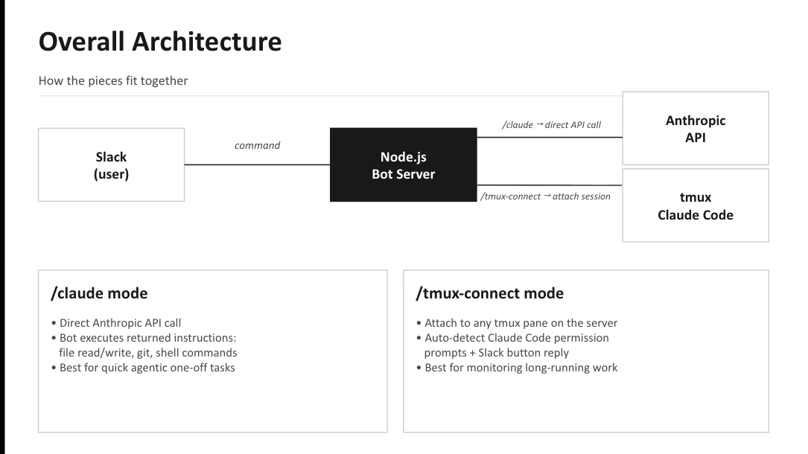

# claude-code-slack

## 🔵 Main Functions
- To control a Claude Code agent running in a server's tmux session
- To make direct Anthropic API calls to the Claude model — independent of the tmux session — for one-off tasks and questions.

## 🔵 Requirements
- A personal Slack workspace (Free Edition also works!)
- A custom Slack bot (files in **`manual/`** explains detailed guidelines to make this bot) 

## 🔵 Repository Structure

```
claude-code-slack/
├── assets/
│   └── overview.png                  # Architecture diagram used in the README
├── manual/
│   ├── claude-slack-manual-EN.pptx   # Step-by-step setup guide (English)
│   └── claude-slack-manual-KO.pptx   # Step-by-step setup guide (Korean)
├── src/
│   ├── .env                          # Your tokens (see security note below)
│   ├── index.js                      # Main bot code — all Slack handlers, tmux control, API calls
│   └── package.json                  # npm dependencies and start script
├── .gitignore                        # Specifies files and directories to be ignored by Git
├── LICENSE                           # MIT license
└── README.md                         # This file
```

### What each directory contains

#### `src/`
The runnable bot. Everything needed to start the bot lives here.

- **`index.js`** — The entire bot in a single Node.js file. Handles the `/claude`, `/tmux-connect`, `/tmux`, `/tmux-status`, and `/tmux-disconnect` slash commands, routes thread replies, polls the tmux pane every 3 seconds for permission prompts, and makes streaming calls to the Anthropic API.
- **`package.json`** — Declares three runtime dependencies (`@slack/bolt`, `@anthropic-ai/sdk`, `dotenv`) and the `start` script. Run `npm install` inside `src/` before first use.
- **`.env`** — Holds the three secret tokens (`SLACK_BOT_TOKEN`, `SLACK_APP_TOKEN`, `ANTHROPIC_API_KEY`) that the bot reads on startup.

#### `manual/`
Visual, slide-by-slide setup walkthroughs. Identical content in two languages.

- **`claude-slack-manual-EN.pptx`** — English version. 19 slides covering Slack app creation, token generation, server installation, running the bot, and feature usage.
- **`claude-slack-manual-KO.pptx`** — Korean version of the same manual.

#### `assets/`
Images referenced by `README.md`.

- **`overview.png`** — The architecture diagram.

## 🔧 Running from this repo

```bash
# 1. Clone
git clone https://github.com/jwyang21/claude-code-slack.git
cd claude-code-slack/src

# 2. Install dependencies
npm install

# 3. Fill in .env with your three tokens
#    (SLACK_BOT_TOKEN, SLACK_APP_TOKEN, ANTHROPIC_API_KEY)

# 4. Run
npm start
```

See `manual/claude-slack-manual-{EN,KO}.pptx` for the full Slack app setup walkthrough.


## ‼️ Security Note
- Never commit your `.env` file — it contains sensitive tokens
- `.gitignore` is preconfigured to exclude `.env` and `node_modules/`

---

## 📝 Detailed Explanation of Functions



### Two Ways the Bot Talks to Claude

This bot uses a personal Slack workspace and a custom Slack app to interact with Claude through **two completely separate paths**. Understanding the distinction matters — they behave differently and are useful for different things.

#### (1) Claude Code in a tmux session — via `/tmux-connect`

- **Target**: a **Claude Code CLI process** already running inside a `tmux` session on the server.
- **How the bot connects**: it uses `tmux send-keys` to inject input and `tmux capture-pane` to read the screen of that process.
- **State**: fully preserved. Whatever project Claude Code has open, whatever task is in flight, whatever permission prompts are pending — all of that context lives inside the tmux session and stays intact across Slack interactions.
- **What it's for**: monitoring and remotely controlling long-running experiments or agentic work that you want to keep running on the server.

#### (2) Direct Anthropic API calls — via `/claude` and `? <question>`

- **Target**: the **Claude model** on Anthropic's API servers — the same model you'd talk to on claude.ai.
- **How the bot connects**: it calls `anthropic.messages.stream({ model, messages, ... })` directly from the Node.js bot.
- **State**: **none**. Each call is independent and stateless. The API has no idea what's running in tmux, what files exist on the server, or what the Claude Code agent is doing.
- **What it's for**: one-off tasks — reading/writing files, running shell commands, `git push`, or general questions — all unrelated to the tmux session.

### Why the distinction matters in practice

Inside a `/tmux-connect` thread, if you type:

```
? How far along is the experiment?
```

the bot strips the `?`, sends `"How far along is the experiment?"` to the Claude API, and that's **all** the API sees. No terminal output, no logs, no project context. Claude will reasonably answer something like "I don't have any information about that experiment."

If instead you type the same thing **without** the `?`:

```
How far along is the experiment?
```

the bot forwards those keystrokes straight into the tmux session. The Claude Code agent running there receives the question with all of its running context (scripts, logs, open files) and can give a real, grounded answer.
